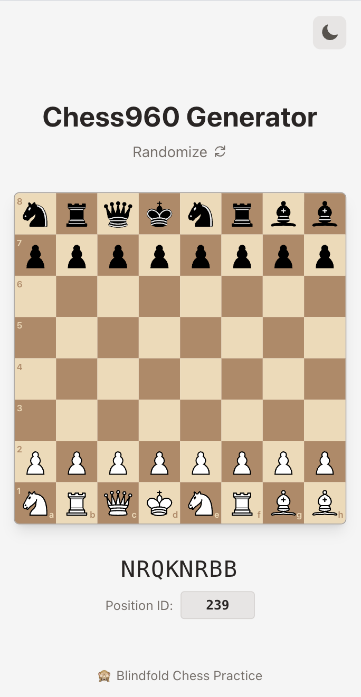

# Chess960 Generator

Generate random Fischer Random Chess (Chess960) starting positions.



## Features

- Generate random Chess960 positions
- Enter Position ID (0-959) to view specific positions
- Light/Dark mode support

## Live Demo

https://chess960.chkm8.workers.dev/

## Development Setup

### Prerequisites

- Node.js 24+ (managed via [Volta](https://volta.sh/))

### Installation

```bash
npm install
```

### Development Server

```bash
npm run dev
```

### Build

```bash
npm run build
```

### Test

```bash
npm run test
```

### Lint

```bash
npm run lint
```
